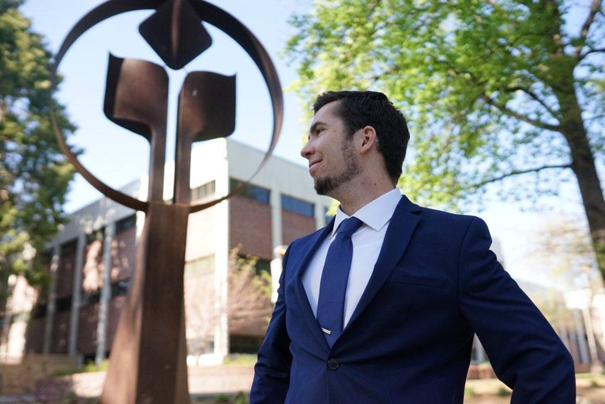

# Austin Devine's UX Portfolio

Hey Everybody! My name is Austin Devine. I'm an economics major minoring in computer science. I completed my capstone last semester and I am wrapping up my last two classes. In my free time, I enjoy performing improv, going bowling, and doing things with my fraternity, ΦΧΘ (Phi Chi Theta). I'm really looking forward to this class and getting to know all of you.

## UX Team Project

## UX Journal 1 
(j01/README.md)

[Read about my experience with Bash](j01/)
