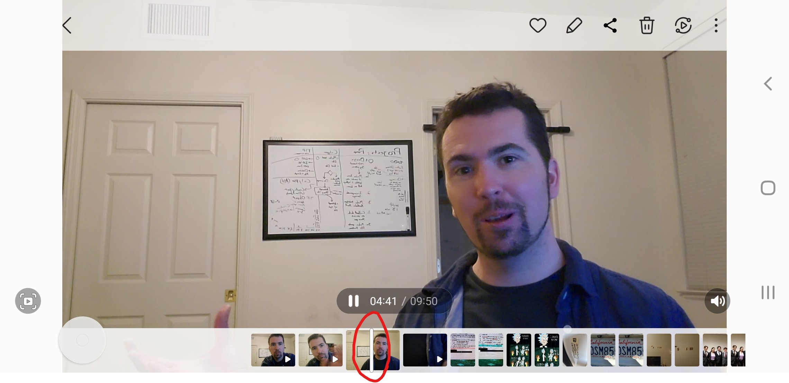
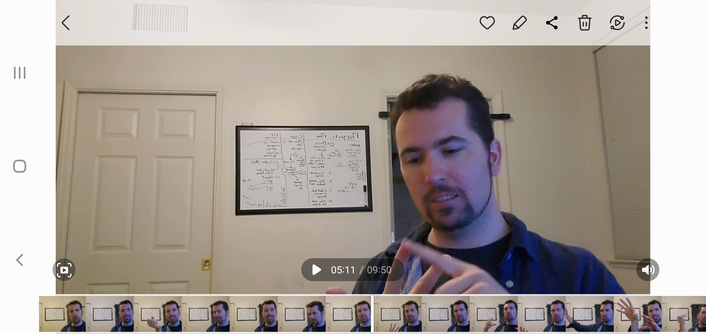

# First Journal Entry...

Like many people in today’s day and age, I own a smartphone. I use a Samsung Galaxy s10+ running the Android operating system. The phone has many features 
but the one I will be referencing is its ability to review recorded videos. I recently decided to record a vlog. I got interrupted about halfway through 
and had to continue my thoughts on a separate recording. To remind myself where I left off with my talking points, I wanted to watch the last 60 seconds of 
my 10-minute video. When I opened up my gallery (in landscape mode), I found and tapped on the thumbnail of the video I wanted to watch. This started to play the video.

Near the bottom of the screen, on the thumbnail of the video, I saw a vertical, line shaped cursor moving to the right, illustrating the approximate 
percentage of the video that had played.  My intuition was to tap and drag that cursor to the right. What happened was the carousel of photos and videos moved 
along with my finger while the video stopped playing.

My first thought was that I didn’t hit the hitbox of the cursor, but it’s hard to tell because there’s no **feedback** for what I assumed to be a button. So I tried 
again and I got the same result. I tried one more time and accidentally held my finger on the thumbnail which expanded the thumbnail into various frames in the 
video. While this action was unintentional it probably would’ve been the next thing that I tried.

After the video was expanded, my first thought was to tap and drag the cursor again. When I tried this, instead of moving the cursor to the right, I was 
dragging the clips to the right while the cursor stayed in the center of the carousel. This created an effect that was the opposite of what I wanted. The 
video was approaching the beginning of the clip not the end. 

Once I realized I couldn’t move the cursor and that I can only move the clip in relation to the cursor, I was 
able to drag the clip to the left which allowed me to find the location I was looking for. This surprised me seeing how I’ve done video editing in a variety of 
programs and everyone I have used so far has had the user move the time cursor around the clips, not the other way around. This created a sense of bad 
**memorability** because my intuition of how to operate the software is confounded by programs with visually similar interfaces. In addition to the specific example 
in this paper, I know I have tried to do this multiple times, and every time I forget how and I have to relearn it, which would be fine if the **learnability** was 
more intuitive. While trying to complete this task was not hard to learn, I did make mistakes in the process and sometimes my **mental model** was completely 
opposite of the **conceptual model**. This means the way I expected it to work was exactly opposite of the way it did work.

