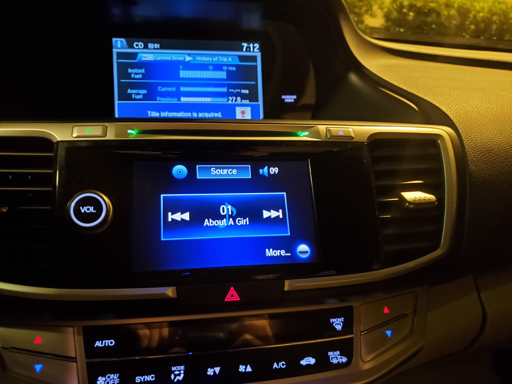

Journal 2: Getting the CD in my car to Pause.

The other day I was driving around town, listening to a compact disc in my car and I decided to get some fast food. Normally I use an auxillary cord hooked
up to my phone as I listen to Spotify or the mp3s on my phone, but for whatever reason I wanted to listen to a CD that day. As I drove up to the speaker box, 
I went to pause the disc, but realized I didn’t know where the pause button was. After a quick visual scan, I didn’t see anything that resembled a pause
button, so I turned the audio system off. After I got my food and started driving home, I turned my audio system back on and the song started playing automatically right where it left off. While this technically did the task I wanted it to do, I wasn’t satisfied. I didn’t necessarily want to turn the audio system off in the process. While I didn’t have any need for these activities at the time, there could’ve been scenarios where I wanted to adjust volume, or the mixer, or just see what artist was playing what song so I could look up trivia or fun facts about the group (while not driving of course). I didn’t like
that I had to turn off my audio system just to get the song to pause so I wanted to see if there was a way to pause the CD without turning off the system.

So a week or two goes by and I decide to investigate. I go down to my parked car and turn it on with the sole intention of seeing if I can pause my CD. I set 
my audio source to the CD drive and it starts playing automatically. On the primary audio screen, the screen between the two air vents and adjacent to the 
volume knob, (see photo) I see a digital box with the track number and song name. In the left of the box I see a symbol that generally represents previous 
track/ restart track, and the right side a symbol that generally means next track.  I try tapping in the center of the box, but the right side of the box 
lights up and it goes to the next track. I try again but the left side of the box lights up and the track restarts. I figure the hitboxes of each of these 
buttons extend to the center of the box.

 
My next thought is to hit the “More…” button. In retrospect this seems silly, but so does a cd player without a pause button. A menu pops up as you can see 
below.

I clicked on screen settings because I thought there might be an option to turn on additional controls. I didn’t find anything. Going back to the menu, I 
clicked on Scan simply because I had no idea what it did, and I’m still not 100% sure but I don’t think it had anything to do with pausing the music. You’ll 
notice in the following picture there is a second screen which is used for a variety of features. It is controlled by a panel of buttons about 6 inches 
below the audio screen and the primary method of interaction involves a rather intricate knob with the word “Enter” on it.

This knob has a ring which can be spun, a protruding part that can be pushed up, down, left and right, and a button on the end which can be pushed in. 
I tried pushing the button in but it did not pause the music. It brought up a menu regarding the “Trip computer” which had nothing to do with what I was 
trying to accomplish. In the previous photo of the panel, there are four buttons that are slightly larger than the others, they are, Nav, Phone, Info, 
and Audio. I clicked on Audio to see what would happen, and was asked to select a source. I selected CD and was greeted with this screen. It showed the 
song that was playing and those that would be following it. I clicked the button on the knob while the selected song was playing, but it only repeated 
the song from the start. I looked back at the panel and clicked the settings button. I selected all the options I thought may have been relevant regarding 
adding a pause button to the screen. After looked through all of there settings, I found nothing that would help me.

It was at this point I realized I was being silly. If someone needed to adjust their music, music controls should be something that the user can do 
with minimal attention to seeing how they would probably be driving. I noticed my steering wheel had a few buttons on the left side. I tried clicking 
the source button. I don’t know why I thought this would be relevant. I think the way the buttons were presented the source button looked the most 
important and I would consider pausing an important function. I tried it, but all it did was change the source of the audio. There was button slightly 
above and to the right of the source button featuring a series of rectangles coming towards the user. Having no idea what that might be I tried pressing 
it. It brought up a navigation menu. There were some additional buttons on the wheel, but I feel extremely confident none of them would accomplish the 
task. I looked at the panel on the driver side door but found nothing relevant there either. As I was about to give up, I got one last idea.

I remembered that in my previous car, the pause button wasn’t even a labeled button. To pause a CD, one had to press in the volume knob into the panel. 
I decided to try that with this car, and you may be surprised to learn, that nothing happened. It wasn’t even a knob that could be pressed in. It was 
at this point that I figured if there was a way to pause the CD, it wasn’t something I was going to figure out on my own. As I was getting ready to 
write this report, I performed a google image search of “Car CD Player 1990” and what I found surprised me. I don’t think I found a single image of a 
car’s CD player with a labeled pause button. While there may be unlabeled buttons such as the volume knob in my old car, I think it’s quite possible my 
newer car can’t pause a CD without changing the source of the music, or turning off the sound system all together.

